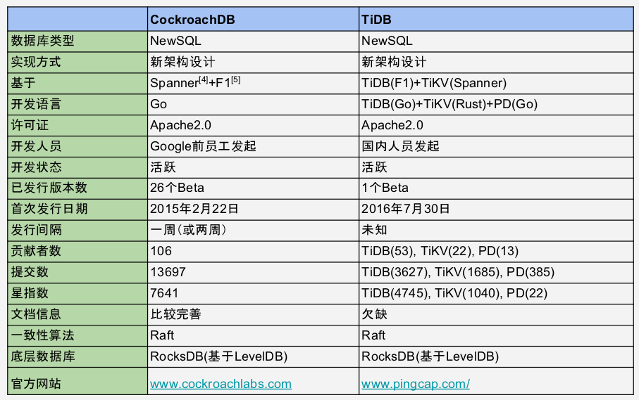
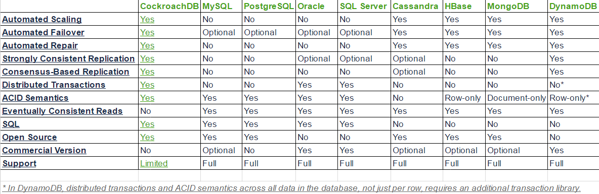
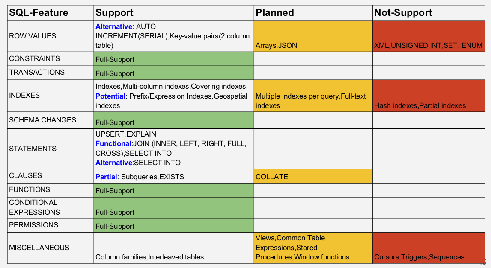
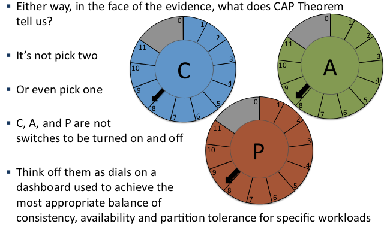

# NewSQL

## 1. 问题

传统数据库不支持水平扩展,带来性能的局限性，NoSQL数据库具备水平扩展，但却不具备ACID事务交易、数据的强一致性、SQL语句的支持等功能，进而给开发带来昂贵的代价。

NewSQL新型分布式数据库旨在解决以上问题,通过结合传统数据库的功能和NoSQL的性能优点,实现高可扩展性和强一致性数据库,支持ACID事务交易，无需在应用层做一致性的控制和事务的处理,简化开发人员的负担，使投入更多精力解决核心业务问题。

## 2. NewSQL的定义

"A DBMS that delivers the scalability and flexibility
promised by NoSQL while retaining the support for SQL
queries and/or ACID, or to improve performance for
appropriate workloads."
-- 451 Group

"SQL as the primary interface
ACID support for transactions
Non-locking concurrency control
High per-node performance
Scalable, shared nothing architecture"
-- Michael Stonebraker

## 3. CockroachDB (NewSQL数据库)

CockroachDB is a distributed SQL database built on a transactional and
strongly-consistent key-value store.
It scales horizontally; survives disk, machine, rack, and even datacenter failures
with minimal latency disruption and no manual intervention.
supports strongly-consistent ACID transactions; and provides a familiar SQL API
for structuring, manipulating, and querying data.

## 4. CockroachDB vs TiDB

## 5. CockroachDB与其它数据库的比较

## 6. CockroachDB SQL支持的范围

## 7. 关于CAP

更多文档信息：

1.[NewSQL新型分布式数据库研究报告_by-wen_2016-10-19.pdf](NewSQL新型分布式数据库研究报告_by-wen_2016-10-19.pdf)

2.[NewSQL大集中实验报告_by-wen_2016-11-18.pdf](NewSQL大集中实验报告_by-wen_2016-11-18.pdf)